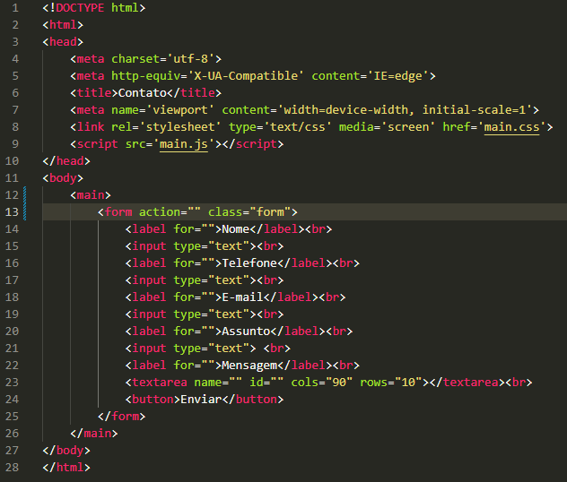
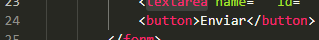

# Projeto - Página de contato

Projeto criado como parte da disciplina de Fundamentos de Desenvolvimento, ministrada pelo professor Leonardo Rocha.

## Índice

* [Descrição](#descrição)
* [Tecnologias](#tecnologias)
* [Referências](#referencias)
* [Autor(a)](#autora)

### Descrição

O projeto consiste na composição de um formulário de retorno, para entrar em um determinado site, entre outros.

### Resultado do projeto.


### Contato 

* DOCTYPE - É uma instrução para o navegador da web que diz em qual versão do HTML a página é escrita.
* Main - Define o título do documento, mostrado na barra de título de um navegador ou na aba da página.
* Link - Especifica as relações entre o documento atual e um recurso externo.
* Head - Providencia informações gerais (metadados) sobre o documento, incluindo seu título e links para scripts e folhas de estilos.
* form - Serve para criar formulários e definir a forma como eles se comportam.
* input - Serve para criar campos de entrada de dados interativos, que permitem o usuário insira textos, números, datas, cores, entre outros.
* label - Especifica o rótulo de um input em um formulário, e é importante para a experiência de um usuário.
* br - Cria uma quebra de linha em um texto.
* textarea - permite ao usuário inserir um texto extenso de forma livre.
* Meta - Define qualquer informação de metadados que não podem ser definidos por outros elementos HTML.
* title - Define o título do documento, mostrado na barra de título de um navegador ou na aba da página.
Veja uma imagem de parte do código, onde é possível identificar o uso dos elementos mencionados a cima:



* button - Insere botões clicáveis em páginas e formulários, que podem executar ações quando um usuário clica neles.

Veja mais uma imagem onde pode-se identificar este outro elemento citado acima:



### Estilização

O projeto foi estilizado, utilizando CSS3. Foi criado um arquivo chamado login.css. Neste arquivo, constam as seguintes configurações de estilo:

* Estilo de cores - A cor de fundo utilizada no projeto foi definida como segue:

```
body{
    background-color: rgb(95, 145, 31);
}
```

O elemento citado acima foi utilizado nas seguintes classes no CSS3:

* .form
* .body - Serve para representar tudo o que é exibido na página.

A definição da distância entre o conteúdo de um elemento e suas bordas foi usada nas seguintes classes no arquivo CSS3:

* .form
* html, body

Foi definido com "padding" e "padding-top" como mostra a seguir:

```
html, body{
    padding: 0;
}
```
```
.form{
    padding: 40px;
    padding-top: 0;
}
```

A altura e largura da área do conteúdo de um elemento foi definida com:

* height - Determina a altura da área do conteúdo de um elemento.
* width - Determina a largura da área de conteúdo de um elemento.

Isto foi mostrado no arquivo README e utilizado, por exemplo, para estilizar o elemento "button" em CSS3, como será visto a seguir:

```
button{
    width: 60px;
    height: 30px;
}
```

A definição da fonte principal da página, "body", foi definida com "font-family" como se vê a seguir:

```
body{
    font-family: Arial, Helvetica, sans-serif;
}
```

Foi adicionado também uma caixa para inserir textos, com bordas arredondadas e sombra com as seguintes propriedades:

```
form{
    border-radius: 20px;
    box-shadow: 0 0 20px black;
}
```

A cor do texto da página foi definida com a propriedade "color" como mostra a seguir:

```
form{
    color: rgb(71, 29, 64);
}
```

## Tecnologias

* HTML
* CSS3
* README
* Git
* GitHub

## Referencias
[Alura](https://www.alura.com.br/artigos/escrever-bom-readme) - Como escrever um README íncrivel no seu GitHub.

## Autor(a)

Projeto desenvolvido pela aluna:
* Maria Clara da Silva Gonçalves